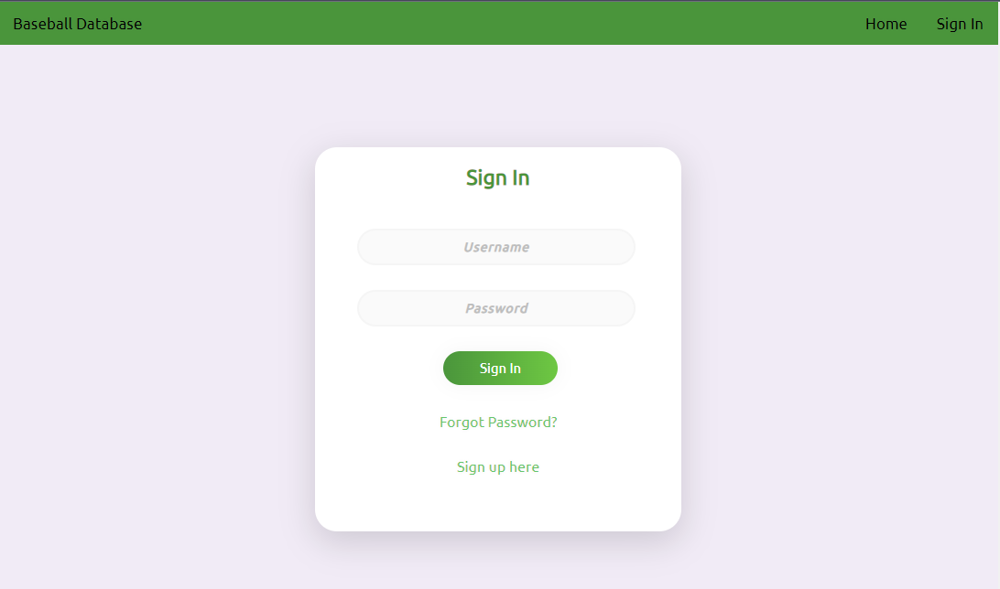
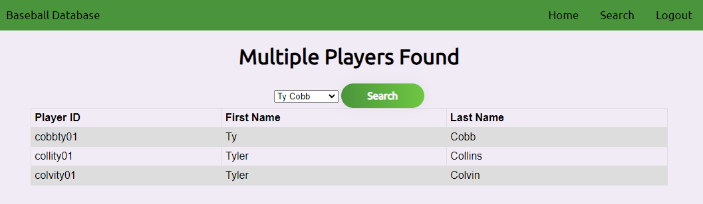
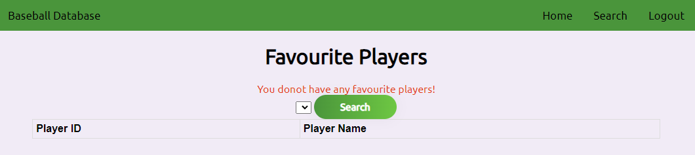
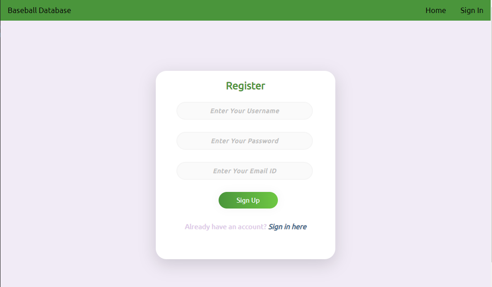
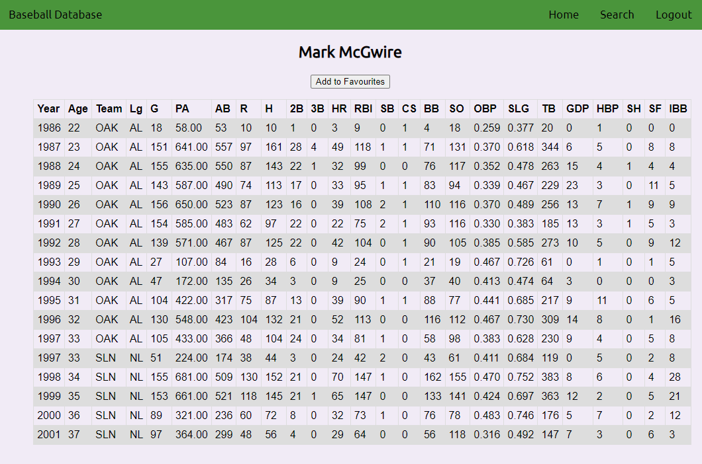
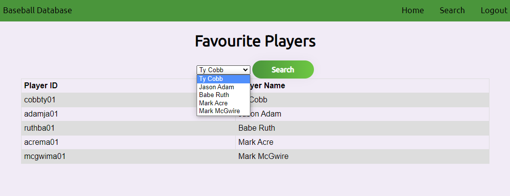
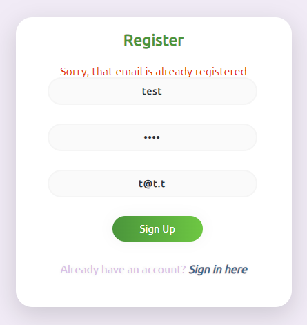

# About **Me**
My Name is Tim.  I am currently a Project Engineer in the transportation industry.  I have a BS in Mechanical Engineering and am currently pursuing a masters in Computer Science.  I also like to mess with the idea of game programming, but really havent been able to branch into anything fun quite yet.

# What I'm learning 🏫

Here is a list of the things I am currently learning/working on
- Languages
  - Python
  - C++
  - C
  - Java
  - SQL

- Frameworks
  - React
  - Spring

- Courses
  - Fullstack Web dev
    - React, Flask, MongoDB, Docker
    - Progress: 100% complete
    - Repo: [Image Gallery](https://github.com/tkm3d1a/image-gallery-udemy)
    - Course: [FullStack Web Dev](https://www.udemy.com/course/full-stack-web-development-bootcamp/)
  - Java/Spring Boot
    - MVC, REST API, OpenAPI Documentation, Testing, Spring Data JPA (SQL), Spring Security (JWT)
    - Progress: Just starting
    - Repo: [none yet](#)
    - Course: [Spring boot dev](https://www.udemy.com/course/the-complete-spring-boot-development-bootcamp/)
    
# My Favorite Repos 🏆

### Baseball Reference Web application
Link: [DB-found-webApp](https://github.com/tkm3d1a/DB-found-webApp)

This was a final group project based around replicating the [baseball-reference](https://www.baseball-reference.com/) website, at least somewhat.  It is a fully local hosted web application with a MariaDB database behind it, built using Python/Flask.  The readme has all the info required to download and install and set up the release branch, and I do plan on updating it to clean up the code.

*My favorite features*
- I did my own hashing and salting of passwords so that they are only stored encrypted, and the plain text version is not exposed
  - It isn't an ideal method and probably doesn't follow best practices, but it works and is pretty dead simple to understand
- No JS or outside languages were used/needed to complete tasks such as filtering/saving of favorite players
- Use and manipulation of DB through ORM

*Screenshots*

| Sign in/Register | Player Search/Display | Favorite Player display |
| -------- | -------- | -------- |
|  |  |  |
|  |  |  |
|  | | |

---

### Image Gallery (Udemy Coursework)
Link: [Image Gallery](https://github.com/tkm3d1a/image-gallery-udemy)

this is a single page web application where the user can search for images (pulled from the Unsplash image website) via keyword entry.  They can then save images to a database that persists over page refreshes.  They can also delete images.  All actions taken by the user also result in a quick notification so the user can get feedback on button clicks and actions they take.

This is the result of the coursework for [this Udemy course](https://www.udemy.com/course/full-stack-web-development-bootcamp/). I learned a lot in completing this course over about a 3 month timeperiod.  The front end was created using React.  The api service is built using Python and Flask.  The Database used was MongoDB.  All services were dockerized and ran locally throughout the devolpment, there are no current plans to fully deploy this yet, but I am looking into that as a good next step for this project.

*My favorite features*
- Using toast to generate notifications
  - The tool has a lot of flexibility and can make some neat notifications to display to the user
- Persistant DB backend
  - This is the first time I am storing user generated data this way and it was different than my previous SQL experience

*screenshots*
| row 1 | row 2 | row 3 |
| ----- | ----- | ----- |
| shot 1| shot 2 | shot 3 |

---

# Project Pipeline 🔭

Outside of learning with some Udemy courses, I am currently working on improving the Baseball Reference application.  I plan on converting it to a react based application, keeping the MaraiDB backend, and utilizing python and flask for the api service.  This will be my "side" project so may not get as many updates, but it will be more detailed and have more involved planing using tools like Figma and Trello.

---

---
